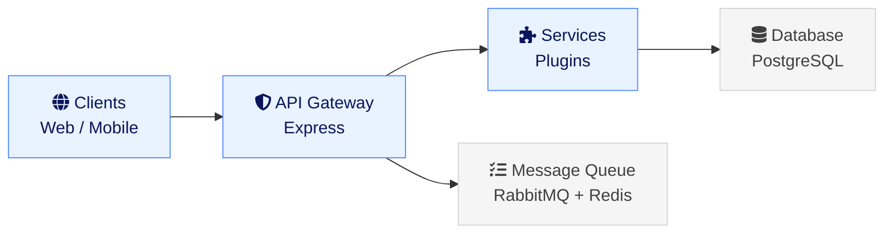

## System Architecture

Hay is designed as a modular, event-driven platform that scales with your needs. This document explains the key architectural decisions and how components work together.

### High-Level Overview



### Core Components

#### 1. API Gateway

The entry point for all client requests:

- **Authentication**: JWT-based auth with refresh tokens
- **Rate Limiting**: Prevents abuse and ensures fair usage
- **Request Validation**: Schema validation using Zod
- **Response Formatting**: Consistent API responses

#### 2. Service Layer

Business logic organized as modular services:

- **Conversation Service**: Manages conversations and messages
- **Playbook Service**: Handles playbook-based workflows and automation
- **Plugin Manager Service**: Connects to external platforms via plugin instances
- **Analytics Service**: Processes and stores metrics

#### 3. Plugin System

Hay's extensibility mechanism:

Plugins are defined using `defineHayPlugin()` from `@hay/plugin-sdk`. The plugin contract is `HayPluginManifest` in `/server/types/plugin-sdk.types.ts`, exposing capabilities via a runtime `/metadata` endpoint and interacting with the platform via `HayGlobalContext`.

Each plugin can:
- Register event listeners
- Extend the API
- Add new UI components
- Access core services

#### 4. Real-Time & Background Messaging

There is no single event bus module. Real-time events are published to Redis pub/sub channels via `ConversationEventsService`. Background processing tasks are queued via RabbitMQ (`rabbitmqService`) and a Redis-backed `JobQueueService`.

#### 5. Data Layer

Persistent storage with caching:

- **PostgreSQL**: Primary data store for conversations, users, settings
- **Redis**: Caching layer and pub/sub for real-time features
- **Object Storage**: Attachments and media files

### Data Flow

#### Incoming Message

1. Message arrives via channel plugin (email, chat, etc.)
2. Channel plugin calls server plugin API to deliver the message
3. Message is validated and stored in database
4. Redis pub/sub broadcasts `message_received` event
5. WebSocket delivers real-time updates to connected clients
6. Orchestrator processes the message via RabbitMQ queue

#### Orchestrator Processing

The orchestrator processes messages through three layers:

1. **Perception**: Analyzes user input to determine intent, sentiment, and context
2. **Retrieval**: Finds relevant documents, knowledge base entries, and matching playbooks
3. **Execution**: Generates AI responses, executes playbook actions, and invokes plugin tools

### Scalability Considerations

#### Horizontal Scaling

Hay is designed to scale horizontally:

- **Stateless API servers**: Scale by adding more instances
- **Background workers**: Scale job processing independently

#### Caching Strategy

Multi-layer caching reduces database load:


- **Client**: Browser cache for static assets
- **CDN**: Configurable asset-domain URL helper for serving static assets from a separate domain, not an integrated CDN caching layer
- **Redis**: In-memory cache for hot data
- **Database**: Source of truth

#### Message Queue

RabbitMQ (via `amqplib`) handles orchestrator messaging, and a custom Postgres-backed job queue (using `SKIP LOCKED`) coordinated through Redis pub/sub handles background jobs:

- Failed jobs are marked as `FAILED` by `JobQueueService.failJob()`; there is no automatic retry
- Job priority is ordered via a SQL column, not a Bull-style priority queue
- No rate limiting per job type

### Security Architecture

#### Defense in Depth

Multiple security layers:

1. **Network**: TLS/SSL encryption for all traffic
2. **Authentication**: JWT with configurable expiration (default 7 days)
3. **Authorization**: Role-based access control (RBAC)
4. **Input Validation**: Sanitize all user input
5. **Output Encoding**: Prevent XSS attacks
6. **Database**: Prepared statements prevent SQL injection

#### Data Privacy

- **Encryption at rest**: Infrastructure concern (configure at the database/disk level, not an application-level feature)
- **Encryption in transit**: Handled at the infrastructure/proxy level (e.g., reverse proxy or load balancer terminates TLS)
- **PII handling**: Privacy service provides GDPR capabilities (data export, anonymization, deletion); logger redacts PII from log output
- **Audit logs**: Key administrative and security events logged via AuditLogService

### Monitoring and Observability

#### Metrics

The application does not currently track these metrics internally. The following are aspirational and would need to be implemented via external monitoring tools:

- API response times
- Error rates
- Queue lengths
- Database query performance
- Cache hit rates

#### Logging

Structured logging:

```typescript
logger.info({ conversationId: '123', action: 'create', duration: 45 }, 'Processing conversation');
```

#### Tracing

Distributed tracing is not currently implemented. This is an aspirational capability that could be added in the future for debugging request flows across services.

## Next Steps

- Learn about our [development philosophy](/docs/technical/philosophy/)
- Start [building plugins](/docs/technical/plugins/getting-started/)
- Explore the [API reference](/docs/technical/plugins/api-reference/)
