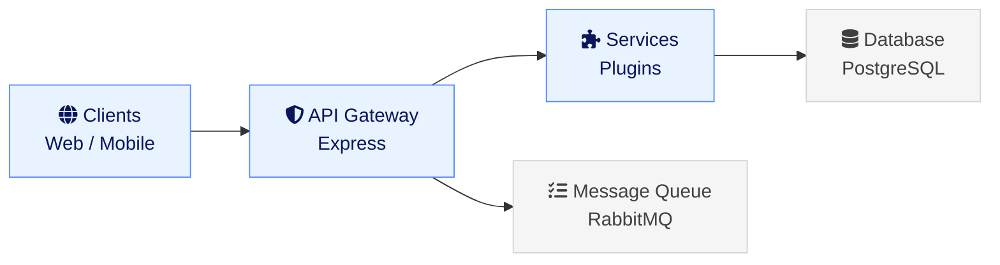
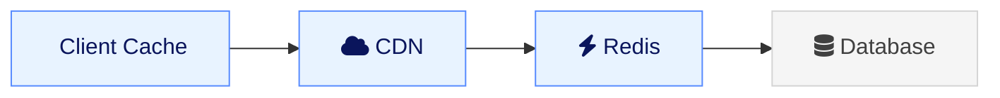

## System Architecture

Hay is designed as a modular, event-driven platform that scales with your needs. This document explains the key architectural decisions and how components work together.

### High-Level Overview



### Core Components

#### 1. API Gateway

The entry point for all client requests:

- **Authentication**: JWT-based auth with refresh tokens
- **Rate Limiting**: Prevents abuse and ensures fair usage
- **Request Validation**: Schema validation using Zod
- **Response Formatting**: Consistent API responses

#### 2. Service Layer

Business logic organized as modular services:

- **Conversation Service**: Manages conversations and messages
- **Analytics Service**: Processes and stores metrics

#### 3. Plugin System

Hay's extensibility mechanism. Plugins are defined by a `manifest.json` (specifically the `hay-plugin` block in each plugin's `package.json`) and communicate with the core platform via MCP (Model Context Protocol).

Each plugin can:
- Expose tools and resources via MCP
- Add new UI components
- Register communication channels

#### 4. Hook System

The codebase uses `HookManager` for internal event-driven communication:

```typescript
// Trigger an event
hookManager.trigger('conversation.created', {
  conversationId: '123',
  channel: 'email',
  customer: { ... }
});

// Register a handler
hookManager.register('conversation.created', async (payload) => {
  // Handle the event
});
```

Hooks flow through the system triggering:
- Real-time updates
- Analytics tracking
- Plugin hooks

#### 5. Data Layer

Persistent storage with caching:

- **PostgreSQL**: Primary data store for conversations, users, settings
- **Redis**: Caching layer and pub/sub for real-time features
- **Object Storage** (optional): Attachments and media files (S3 is optional; default is local filesystem)

### Data Flow

#### Incoming Message

1. Message arrives via a channel plugin (e.g., webchat, WhatsApp, email)
2. Channel plugin publishes the message to the RabbitMQ orchestrator queue
3. `orchestratorWorker` picks up the message from the queue
4. Message is validated and stored in the database
5. AI execution layer processes the message and generates a response
6. Real-time updates sent to connected clients

#### Automation Execution

1. Rule trigger conditions evaluated
2. If matched, rule added to job queue
3. Worker picks up job from queue
4. Actions executed in sequence
5. Results logged and stored
6. Completion event emitted

### Scalability Considerations

#### Horizontal Scaling

Hay is designed to scale horizontally:

- **Stateless API servers**: Scale by adding more instances
- **Background workers**: Scale job processing independently
- **Database read replicas**: Distribute read load

#### Caching Strategy

Multi-layer caching reduces database load:



- **Client**: Browser cache for static assets
- **CDN**: Edge caching for global delivery
- **Redis**: In-memory cache for hot data
- **Database**: Source of truth

#### Message Queue

RabbitMQ queue for reliable background processing:

- Retry failed jobs automatically
- Priority queues for urgent tasks
- Rate limiting per job type
- Monitoring and alerting

### Security Architecture

#### Defense in Depth

Multiple security layers:

1. **Network**: TLS/SSL encryption for all traffic
2. **Authentication**: JWT with short expiration
3. **Authorization**: Role-based access control (RBAC)
4. **Input Validation**: Sanitize all user input
5. **Output Encoding**: Prevent XSS attacks
6. **Database**: Prepared statements prevent SQL injection

#### Data Privacy

- **Encryption at rest**: Database encryption enabled
- **Encryption in transit**: TLS 1.3 required
- **PII handling**: Separate tables with restricted access
- **Audit logs**: All data access logged

### Monitoring and Observability

#### Metrics

Key metrics tracked:

- API response times
- Error rates
- Queue lengths
- Database query performance
- Cache hit rates

#### Logging

Structured logging with correlation IDs:

```typescript
logger.info({ correlationId: req.id, conversationId: '123', action: 'create', duration: 45 }, 'Processing conversation');
```

#### Tracing

Distributed tracing for debugging:
- Request flows across services
- Performance bottleneck identification
- Error source pinpointing

## Next Steps

- Learn about our [development philosophy](/docs/technical/philosophy/)
- Start [building plugins](/docs/technical/plugins/getting-started/)
- Explore the [API reference](/docs/technical/plugins/api-reference/)
