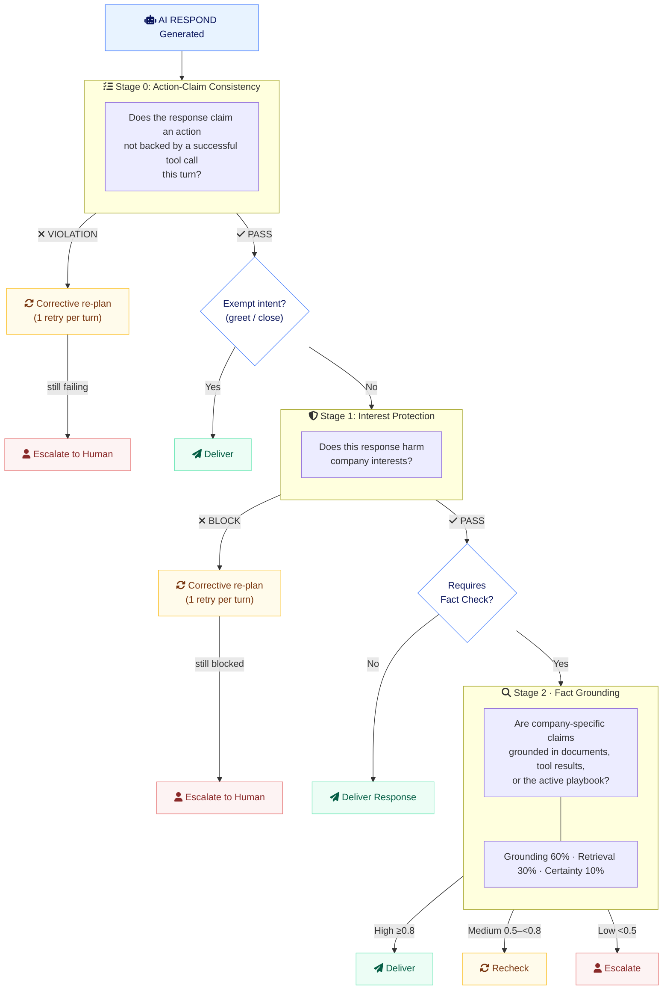

# Three-Stage Guardrail System

## Overview

Hay runs every AI `RESPOND` step through a three-stage guardrail pipeline before delivery:

- **Stage 0 — Action-Claim Consistency**: blocks responses that claim a state-changing action was performed when no tool call backs it this turn.
- **Stage 1 — Company Interest Protection**: blocks responses that harm company interests (off-topic, competitor info, fabrications).
- **Stage 2 — Fact Grounding**: verifies company-specific claims against retrieved documents, tool results, and the active playbook.

The pipeline lives in `applyConfidenceGuardrails()` in `/server/orchestrator/execution.layer.ts`. Stage 0 runs first — even for conversational intents — while Stages 1 and 2 are skipped entirely when the customer's last message has an exempt intent (`GREET`, `CLOSE_SATISFIED`, `CLOSE_UNSATISFIED`), so a false "I've cancelled it, glad I could help!" on a closing message is still caught.

## Architecture



## Stage 0: Action-Claim Consistency

### Purpose

Prevent the orchestrator from telling the customer a state-changing action happened ("I've initiated the cancellation...") when no tool call backed it during the current turn. Implemented by `ActionClaimGuardrailService` (`assessActionClaim()`).

### How It Works

The orchestrator loop in `/server/orchestrator/run.ts` keeps a **tool ledger** for the turn (`toolsCalledThisTurn`): every tool call is recorded as `{ name, success }`. Conversation history is not turn-scoped, so the ledger is the source of truth for "what actually ran this turn". An LLM judge (prompt `execution/action-claim-check`) sees the response, the last customer message, recent conversation history, and the formatted ledger, and returns:

```typescript
{
  claimsAction: boolean;     // Response asserts a state-changing action was performed/initiated
  claimedActions: string[];  // Short descriptions of the claimed actions
  backedByTools: boolean;    // ALL claims backed by SUCCESSFUL tool calls this turn
  reasoning: string;
  passed: boolean;           // !claimsAction || backedByTools
}
```

A **failed** tool call does not back a success claim.

### On Violation

1. **Corrective retry** (while `maxRetries` allows, default 1 per turn): the planner is re-run with explicit feedback — actually call the tool, rephrase without claiming the action, or `HANDOFF`. The retry budget (`turnGuardrailState.actionClaimRetries`) lives in the `run.ts` loop and is shared by reference, so it is per turn even across recursive re-plans. A `RESPOND` retry re-enters the full guardrail pipeline; a `CALL_TOOL` retry returns to the orchestrator loop for normal execution.
2. **Retries exhausted**:
   - `escalateOnFailure: true` (default) → converted to `HANDOFF` with reason "Claimed action without tool execution" and a contextual fallback message.
   - `escalateOnFailure: false` → the false claim is replaced with the fallback message (no further stages needed for canned text).

### Failure Mode

Stage 0 **fails open**: on any evaluation error it returns a passing assessment ("never block conversations on guardrail outages").

## Stage 1: Company Interest Protection

### Purpose

Block responses that harm company interests while allowing helpful, on-topic assistance. Implemented by `CompanyInterestGuardrailService` (`assessCompanyInterest()`, prompt `execution/company-interest-check`).

### What Gets Blocked

Violation types (enum `ViolationType`):

#### 1. Off-Topic Responses (`violationType: "off_topic"`)

Responses completely unrelated to the company's business domain.

```
❌ BLOCKED
Customer: "What's the weather like?"
AI: "Let me check the weather for your city. Which city are you in?"

✅ SHOULD BE
AI: "I can't help with weather information. Is there anything about our products I can help you with?"
```

#### 2. Competitor Information (`violationType: "competitor_info"`)

Generic information about competitors without company advantage.

#### 3. Fabricated Products (`violationType: "fabricated_product"`)

Mentioning products/features not in catalog or tool results.

#### 4. Fabricated Policies (`violationType: "fabricated_policy"`)

Inventing company policies, procedures, or rules not backed by documents.

Each violation carries a `severity` (`critical` | `moderate` | `low` | `none`). **Critical violations are always blocked** regardless of config; other violations are blocked according to the `blockOffTopic` / `blockCompetitorInfo` / `blockFabrications` flags.

### What Gets Allowed

- **Clarifications** — the AI explaining its own terminology or questions (`allowClarifications`, default true).
- **Tool results** — responses presenting real data from tool calls. The evaluation context includes `hasToolResults` (any successful tool message in the last 3) and `hasRetrievedDocuments`. Failed tool messages are filtered out of the history the judge sees, so a successful retry is not "contradicted" by its own earlier failed attempt.
- **General conversation** — greetings, acknowledgments, offers to help.
- **Company claims** — pass Stage 1 but set `requiresFactCheck: true`, sending the response to Stage 2.

### On Block

1. **Corrective retry** (while `maxRetries` allows, default 1 per turn, tracked in `turnGuardrailState.companyInterestRetries`): the planner is re-run with the reviewer's reasoning — only state policies/facts backed by the active playbook, retrieved documents, or tool results, or use `HANDOFF`.
2. **Retries exhausted**: always escalate — `HANDOFF` with reason `Company interest violation: <type>` and a contextual fallback message. The original blocked message is preserved as `originalMessage`.

### Failure Mode

On evaluation error, Stage 1 allows the response but forces `requiresFactCheck: true`.

## Stage 2: Fact Grounding

### Purpose

Only activated when Stage 1 passes AND sets `requiresFactCheck: true`. Verifies that factual claims about the company are grounded in evidence. Implemented by `ConfidenceGuardrailService` (`assessConfidence()`).

### Grounding Sources

`assessResponseConfidence()` in the execution layer builds the evidence set from:

1. **Retrieved documents** — full content of the conversation's `document_ids`, with similarity scores taken from `orchestration_status.rag.retrievedDocuments` (0.5 when unknown).
2. **Recent tool results** — the last 3 _successful_ tool messages, added as synthetic documents with similarity 0.95 (authoritative). Failed calls are excluded.
3. **Active playbook** — the rendered playbook instructions from the conversation's Playbook message, added with similarity 0.95, so policy statements driven by the playbook are not flagged as ungrounded.

### Scoring Components

Weights are fixed in `ConfidenceGuardrailService.WEIGHTS`:

#### Grounding Score (60% weight)

LLM evaluation (prompt `execution/confidence-grounding`) of whether the response is extracted from the provided context vs. the model's prior knowledge. Returns 0.0 automatically when no documents/evidence were retrieved; on evaluation error a conservative 0.3 is used.

#### Retrieval Score (30% weight)

Average similarity score across the evidence set (0.0 with no documents).

#### Certainty Score (10% weight)

LLM self-assessment of confidence (prompt `execution/confidence-certainty`); 0.5 on evaluation error.

### Confidence Tiers

| Tier       | Score    | Action                                                  |
| ---------- | -------- | ------------------------------------------------------- |
| **High**   | ≥ 0.8    | ✓ Deliver immediately                                   |
| **Medium** | 0.5–0.79 | ⚡ Trigger automatic recheck (if `enableRecheck`)       |
| **Low**    | < 0.5    | ⚠ Escalate to human (if `enableEscalation`) or fallback |

### Recheck Mechanism

When Medium confidence (`performRecheck()`):

1. Retrieve more documents with a relaxed strategy: up to `recheckConfig.maxDocuments` (default 10) at similarity threshold `recheckConfig.similarityThreshold` (default 0.3), queried from the last 3 customer messages.
2. Temporarily add the new documents to the conversation.
3. Re-execute the full pipeline with the additional context.
4. Re-assess confidence.
5. Keep the new response only if the score improved; otherwise revert the documents and the original response stands. At most one recheck per response (`recheckCount` is 0 or 1).

### Low Confidence Handling

If `shouldEscalate` (low tier) — or a recheck still lands in the low tier:

- `enableEscalation: true` → convert to `HANDOFF` with reason "Low confidence in AI response - unverified company claims".
- `enableEscalation: false` → replace the response with the fallback message.

In both cases the replaced text is preserved as `originalMessage`.

## Contextual Fallback Messages

All escalation/fallback paths use `composeContextualFallbackMessage()`: an LLM (prompt `execution/contextual-fallback`) composes a fallback reply from the last 6 **customer-visible** messages in the customer's language, so the customer gets an acknowledgement of their actual request instead of a canned line. The blocked response is deliberately excluded from the composer's input so unverified claims cannot leak through. On any error or empty output, the static configured `fallbackMessage` is used.

## Configuration

### Organization-Level Settings

Guardrail config lives in the organization `settings` JSONB (`OrganizationSettings` in `/server/types/organization-settings.types.ts`). Each service also supports agent-level overrides via `mergeConfig(orgSettings, agentSettings)`, but the execution layer currently passes only organization settings (memoized per `ExecutionLayer` instance).

```typescript
{
  "companyDomain": "e-commerce", // Optional: helps Stage 1 understand context

  // Stage 0: Action-Claim Consistency
  "actionClaimGuardrail": {
    "enabled": true,
    "maxRetries": 1,             // Corrective re-plans per turn before escalating
    "escalateOnFailure": true    // HANDOFF vs fallback message when retries exhausted
  },

  // Stage 1: Company Interest Protection
  "companyInterestGuardrail": {
    "enabled": true,
    "blockOffTopic": true,
    "blockCompetitorInfo": true,
    "blockFabrications": true,
    "allowClarifications": true
    // The service default also includes maxRetries: 1 (corrective re-plans per turn)
  },

  // Stage 2: Fact Grounding
  "confidenceGuardrail": {
    "highThreshold": 0.8,
    "mediumThreshold": 0.5,
    "enableRecheck": true,
    "enableEscalation": true,
    "fallbackMessage": "I'm not confident I can provide an accurate answer...",
    "recheckConfig": {
      "maxDocuments": 10,
      "similarityThreshold": 0.3
    }
  }
}
```

All guardrail LLM evaluations run on the `medium` model tier with temperature 0.2 and structured JSON output.

## Message Metadata

Bot responses that went through Stages 1/2 include guardrail information in message metadata (built in `/server/orchestrator/run.ts`):

```typescript
{
  // Stage 1: Company Interest
  companyInterest: {
    passed: true,
    violationType: "none",
    severity: "none",
    shouldBlock: false,
    requiresFactCheck: false,
    reasoning: "Clarifying terminology",
    retryAttempted: false
  },

  // Stage 2: Fact Grounding (if it ran)
  confidence: 0.85,
  confidenceTier: "high",
  confidenceBreakdown: {
    grounding: 0.9,
    retrieval: 0.8,
    certainty: 0.7
  },
  confidenceDetails: "...",
  documentsUsed: [...],
  recheckAttempted: false,
  recheckCount: 0,

  // Original message if replaced by a fallback
  originalMessage: "..."
}
```

Stage 0 assessments are carried on the `ExecutionResult` (`actionClaim`, `actionClaimRetryAttempted`) and, on escalation, in the handoff fields (`claimedActions`, `toolsCalledThisTurn`) — they are not currently persisted in message metadata or the guardrail log.

## Orchestration Logs

`saveConfidenceLog()` in `run.ts` appends a `GuardrailLogEntry` to the conversation's `orchestration_status.guardrailLog` whenever Stage 1 or Stage 2 ran:

```typescript
{
  "guardrailLog": [
    {
      "timestamp": "2025-11-23T12:00:00Z",
      "companyInterest": {
        "passed": true,
        "violationType": "none",
        "severity": "none",
        "shouldBlock": false,
        "requiresFactCheck": true,
        "reasoning": "Response makes company claim about return policy"
      },
      "factGrounding": {
        "score": 0.92,
        "tier": "high",
        "breakdown": {...},
        "documentsUsed": [...],
        "recheckAttempted": false,
        "recheckCount": 0,
        "details": "..."
      }
    }
  ]
}
```

A legacy `confidenceLog` array is also maintained for backward compatibility whenever Stage 2 runs.

## Use Cases

### Use Case 1: Unbacked Action Claim (Stage 0 Block)

```
Customer: "cancel my order"
AI: "Done! I've cancelled your order."
(no cancel tool was called this turn)

Stage 0: ✗ VIOLATION - claim not backed by tool ledger
→ Corrective re-plan: planner calls the cancel tool, or rephrases, or HANDOFF
→ If still failing: ✗ ESCALATED
```

### Use Case 2: Clarification (Stage 1 Pass, No Fact Check)

```
Customer: "what do you mean by monthly ticket volume"
AI: "Monthly ticket volume refers to the number of support tickets per month."

Stage 0: ✓ PASS - no action claimed
Stage 1: ✓ PASS - Clarification, no fact check needed
Stage 2: ⊗ SKIPPED
Result: ✓ DELIVERED
```

### Use Case 3: Off-Topic (Stage 1 Block)

```
Customer: "what's the weather?"
AI: "Let me check the weather for you..."

Stage 1: ✗ BLOCK - Off-topic for e-commerce
→ One corrective re-plan with reviewer reasoning
→ If still blocked: ✗ ESCALATED with contextual fallback
```

### Use Case 4: Company Claim, High Confidence

```
Customer: "what's your return policy?"
AI: "Our return policy allows returns within 30 days."

Stage 1: ✓ PASS - Requires fact check
Stage 2: ✓ HIGH CONFIDENCE (0.92) - Verified in docs
Result: ✓ DELIVERED
```

### Use Case 5: Company Claim, Low Confidence

```
Customer: "what are your business hours?"
AI: "We operate 9am-5pm Monday-Friday."

Stage 1: ✓ PASS - Requires fact check
Stage 2: ✗ LOW CONFIDENCE (0.35) - Not in docs
Result: ✗ ESCALATED (or fallback if escalation disabled)
```

## Best Practices

1. **Set Company Domain**: Add `companyDomain` to organization settings for better Stage 1 evaluation
2. **Monitor Guardrail Logs**: Review `guardrailLog` in `orchestration_status` to identify patterns
3. **Adjust Stage 1**: Fine-tune `blockOffTopic`, `blockCompetitorInfo`, `blockFabrications` based on use case
4. **Adjust Stage 2**: Fine-tune `highThreshold` / `mediumThreshold` based on risk tolerance
5. **Document Coverage**: Ensure comprehensive knowledge-base docs so company claims pass Stage 2
6. **Keep Stage 0 enabled**: it is the only defense against confidently-claimed actions that never ran

## API Integration

```typescript
// Get conversation with guardrail data
const conversation = await Hay.conversations.get.query({ id: conversationId });

// Access guardrail information
conversation.messages.forEach((message) => {
  if (message.type === "BotAgent" && message.metadata) {
    // Stage 1
    if (message.metadata.companyInterest) {
      console.log("Company Interest:", message.metadata.companyInterest);
    }

    // Stage 2
    if (message.metadata.confidence) {
      console.log("Fact Grounding:", message.metadata.confidence);
    }
  }
});
```

## Troubleshooting

### Issue: Clarifications being blocked

**Cause**: Stage 1 not recognizing clarifications
**Solution**: Ensure `allowClarifications: true` in config

### Issue: Too many escalations

**Cause**: Stage 1 too restrictive OR Stage 2 thresholds too high
**Solution**: Review `guardrailLog` to identify which stage is blocking

### Issue: Tool results triggering fact checks

**Cause**: Stage 1 not detecting tool results
**Solution**: Ensure tool messages (with `toolStatus` ≠ `ERROR`) are in conversation history

### Issue: Legitimate action confirmations blocked by Stage 0

**Cause**: The action's tool call happened in a previous turn (the ledger is per-turn)
**Solution**: The corrective retry usually resolves this by rephrasing; if it recurs, review the planner prompt so confirmations reference the earlier completed step instead of claiming a new action

## Technical Details

### Services

- `ActionClaimGuardrailService` - Stage 0 implementation
- `CompanyInterestGuardrailService` - Stage 1 implementation
- `ConfidenceGuardrailService` - Stage 2 implementation

### Prompts

- `execution/action-claim-check` - Stage 0 evaluation (EN, PT, ES)
- `execution/company-interest-check` - Stage 1 evaluation (EN, PT, ES)
- `execution/confidence-grounding` - Stage 2 grounding (EN, PT, ES)
- `execution/confidence-certainty` - Stage 2 certainty (EN, PT, ES)
- `execution/contextual-fallback` - Contextual fallback composer (EN, PT, ES)

### Files

- `/server/services/core/action-claim-guardrail.service.ts`
- `/server/services/core/company-interest-guardrail.service.ts`
- `/server/services/core/confidence-guardrail.service.ts`
- `/server/orchestrator/execution.layer.ts` - pipeline wiring (`applyConfidenceGuardrails`, `applyActionClaimGuardrail`)
- `/server/orchestrator/run.ts` - tool ledger, per-turn retry budgets, metadata and log persistence
- `/server/orchestrator/types.ts` - `GuardrailLogEntry`
- `/server/types/organization-settings.types.ts` - config types and defaults

### Tests

- `/server/tests/services/action-claim-guardrail.service.test.ts`
- `/server/tests/orchestrator/execution-action-claim.test.ts`
- `/server/tests/orchestrator/execution-company-interest-retry.test.ts`
- `/server/tests/orchestrator/execution-confidence-context.test.ts`
- `/server/tests/orchestrator/company-interest-history.test.ts`
