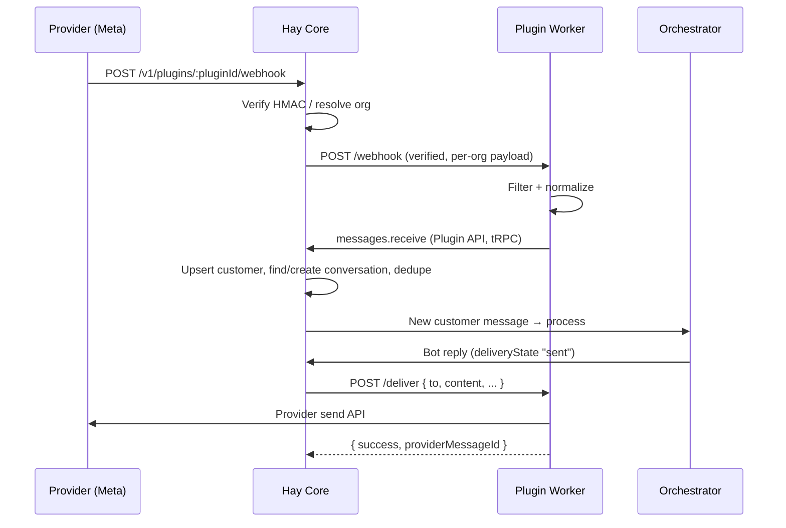

# Channel Plugin Architecture

> **How channel plugins (Instagram, WhatsApp, Chatwoot, …) move messages between external platforms and Hay — end-to-end, as actually implemented.**

## Overview

A channel plugin connects an external messaging platform to Hay's orchestrator. The full loop:

- **Inbound**: the provider POSTs a webhook to core → core routes it to the plugin's per-org worker → the worker verifies/filters/normalizes → the worker calls back into core with `messages.receive` → core creates the customer/conversation/message → the orchestrator responds.
- **Outbound**: the orchestrator (or a human agent) produces a reply → the `ChannelDeliveryService` POSTs it to the worker's `/deliver` route → the plugin calls the provider's send API.
- **Escalation**: when a conversation flips to `pending-human`, core POSTs the worker's `/escalate` route (optional — plugins may not implement it).

Channel plugins run under the same worker model as every other plugin: a separate per-`(org, plugin)` HTTP process spawned from the SDK runner, idle-killed after inactivity. Core talks to workers over localhost HTTP; workers talk back to core over a tRPC-over-HTTP Plugin API authenticated with a scoped JWT.

This document uses `plugins/core/instagram` (plugin ID `hay-channel-instagram-meta`) as the running example.

---

## What Makes a Plugin a Channel Plugin

There is no `manifest.json`. All metadata lives in the plugin's `package.json` under the `hay-plugin` key. A channel plugin declares:

```json
{
  "name": "hay-channel-instagram-meta",
  "type": "module",
  "hay-plugin": {
    "entry": "./dist/index.js",
    "displayName": "Instagram",
    "category": "channel",
    "channel": "instagram",
    "capabilities": ["messages", "customers"],
    "env": ["META_APP_ID", "META_APP_SECRET", "META_VERIFY_TOKEN"]
  }
}
```

_(verbatim from `plugins/core/instagram/package.json`)_

The load-bearing fields:

- **`category: "channel"`** — classifies the plugin in the marketplace.
- **`channel: "<slug>"`** — the channel slug (e.g. `"instagram"`). This is the join key for outbound delivery: `Conversation.channel` is a free-form string, and core resolves which plugin owns a channel via `pluginManagerService.findPluginIdByChannel(channel)`, which matches this field.
- **`capabilities: ["messages", "customers"]`** — scopes the worker's Plugin API JWT so it may call `messages.*` and `customers.*` procedures.

The entry module registers Express-style routes on the worker in `onInitialize`:

```typescript
// plugins/core/instagram/src/index.ts
register.route("POST", "/webhook", async (req, res) => {
  /* inbound */
});
register.route("POST", "/deliver", async (req, res) => {
  /* outbound */
});
```

`/webhook` and `/deliver` are conventions, not registry magic: `/webhook` is where core's proxy and shared-webhook router forward provider payloads, and `/deliver` is the route `ChannelDeliveryService` POSTs to.

---

## System Flow



---

## Inbound: Webhook Ingress

### The ingress route

All plugin worker traffic enters through one catch-all Express router mounted at `/v1/plugins` (`server/main.ts` → `server/routes/v1/plugins/proxy.ts`):

```
ALL /v1/plugins/:pluginId/*
```

The plugin ID is the npm package name (e.g. `hay-channel-instagram-meta`), so a webhook URL looks like:

```
POST https://<host>/v1/plugins/hay-channel-instagram-meta/webhook
```

The proxy decides between two paths:

1. **Shared-webhook routing** — if the path is exactly `/webhook`, the request carries **no** org identifier, and the plugin declares a `webhookRouting` descriptor in its metadata, the request is diverted to `webhookRouterService.handle()` (see below).
2. **Per-org proxy** — otherwise, core resolves the organization from the `?organizationId=<uuid>` query param or the `x-organization-id` header (both validated as UUIDs and checked against the DB), starts or reuses the org's worker, and forwards the request to `http://localhost:<workerPort><path>`.

When forwarding, the proxy:

- **Strips credential-bearing headers**: `authorization`, `cookie`, `x-forwarded-for`, `x-real-ip`, `proxy-authorization`, `content-length`.
- **Preserves signature-verification material**: since Express has already JSON-parsed the body, the proxy adds `x-original-url` (the external-facing URL, honoring `X-Forwarded-Proto`) and `x-original-body-base64` (the exact raw request bytes, captured by a body-parser `verify` hook in `server/main.ts` as `req.rawBody`). Plugins that verify per-instance HMAC signatures (e.g. Chatwoot) recompute the digest over these raw bytes.

If no org can be resolved (and there's no routing descriptor), the proxy returns `401`.

### Shared webhooks: `register.webhookRouting`

Some providers (Meta being the canonical case) deliver **all** tenants' events to a single app-level webhook URL with no org identifier anywhere in the request. Hay solves this generically: the plugin _declares_ a data-only routing strategy, and core executes it blindly without ever learning which provider it is.

Instagram's declaration (`plugins/core/instagram/src/index.ts`):

```typescript
register.webhookRouting({
  signature: {
    header: "x-hub-signature-256",
    format: "sha256-hmac", // the only supported format
    secretEnv: "META_APP_SECRET",
  },
  verificationChallenge: {
    modeParam: "hub.mode",
    verifyTokenParam: "hub.verify_token",
    challengeParam: "hub.challenge",
    verifyTokenEnv: "META_VERIFY_TOKEN",
  },
  routeKeyPath: {
    itemsPath: "entry", // dot-path to the array of items
    keyPath: "id", // dot-path within each item to the routing key
  },
});
```

Core's side (`server/services/webhook-router.service.ts`) then handles the shared URL:

1. **GET** → verification handshake. Core checks `hub.mode === "subscribe"` and the verify token against the declared env var, then echoes `hub.challenge`. The worker never sees GET requests — Instagram registers no GET route.
2. **POST** → core verifies the HMAC-SHA256 signature **once over the exact raw bytes** (timing-safe compare, `sha256=` prefix tolerated — `verifyHmacSha256` in `server/services/plugin-route.service.ts`), responds `200 { received: true }` immediately, then fans out asynchronously.
3. **Fan-out** — for each item under `itemsPath`, core extracts the value at `keyPath` (a safe dot-path getter, no eval), looks up which org owns that routing key (`plugin-webhook-route.repository`), groups items per org, reconstructs a per-org body containing only that org's items, and POSTs it to each org worker's `/webhook` with the internal header **`x-hay-webhook-verified: true`**. Unknown routing keys are logged and dropped.

**Where routing keys come from:** the `onConnected` lifecycle hook. Right after OAuth tokens are stored, core calls the worker's `/on-connected`; the plugin returns opaque routing keys that core persists. Instagram resolves the connected IG business account ID(s) via the Graph API and returns them — those IDs are exactly what appears in `entry[].id` on inbound webhooks:

```typescript
async onConnected(ctx) {
  const token = ctx.auth.get()?.credentials.accessToken;
  if (!token) return { routingKeys: [] };
  const client = new GraphClient({ logger: ctx.logger });
  const routingKeys = await client.getConnectedAccountIds(token);
  return { routingKeys };
}
```

`onConnected` never fails the OAuth flow — throwing is tolerated and core reconciles later.

### Legacy per-instance webhook path

A separate route family, `ALL /plugins/webhooks/:pluginName/:webhookPath` (handled by `pluginRouteService.handleWebhook` in `server/services/plugin-route.service.ts`), predates the worker proxy and is still mounted in `server/main.ts`. New channel plugins should use the `/v1/plugins/:pluginId/webhook` proxy path.

---

## Inbound: Normalization in the Worker

The worker's `/webhook` handler is where all provider-specific knowledge lives. Instagram's handler (`plugins/core/instagram/src/webhook.ts`) illustrates the pattern:

1. **Trust check** — reject any request missing `x-hay-webhook-verified: true` with `403`. The worker is localhost-only behind core; core already verified the shared HMAC, so the worker does not re-verify.
2. **Availability check** — return `503` if credentials aren't loaded yet (org hasn't completed OAuth).
3. **Filter** — Instagram log-and-ignores: echoes of its own outbound (`message.is_echo`), non-message events (postbacks/reactions), and attachment-only or empty-text messages (text-only MVP). It also normalizes both delivery shapes Meta uses (`entry[].messaging[]` and `entry[].changes[].value` where `field === "messages"`).
4. **Enrich** — best-effort sender profile lookup via the Graph API; failures degrade gracefully rather than dropping the message.
5. **Hand off to core** — call `messages.receive` on the Plugin API:

```typescript
await apiClient.mutation("messages.receive", {
  from: `instagram:${senderPsid}`, // channel-scoped external identity
  content: text,
  channel: "instagram",
  senderType: "customer",
  metadata: {
    username,
    profileName,
    mid: message.mid, // provider message id → core-side dedupe
    igAccountId,
    timestamp: event.timestamp,
  },
});
```

6. **Response semantics** — return `200` for anything handled (including ignored events); return `500` only for genuine processing failures, since providers like Meta retry on 5xx.

The Plugin API client is plain tRPC-over-HTTP: `POST ${HAY_API_URL}/v1/pluginApi.messages.receive` with `Authorization: Bearer ${HAY_API_TOKEN}` (both env vars injected by core when it spawns the worker). Note: each channel plugin currently ships its own copy of this small client (e.g. `plugins/core/instagram/src/plugin-api.ts`) — it is not yet an SDK export.

---

## Inbound: What Core Does with `messages.receive`

Server side: `server/routes/v1/plugin-api/trpc.ts`, procedure `messages.receive` (capability-gated on `messages`). Input schema:

```typescript
{
  from: string,                       // channel-scoped external id, e.g. "instagram:<psid>"
  content: string,
  channel: string,                    // channel slug, max 64 chars
  metadata?: Record<string, any>,
  senderType?: "customer" | "human_agent",   // default "customer"
  externalConversationId?: string,    // provider-side conversation id (e.g. Chatwoot)
}
```

Processing steps, in order:

1. **Customer** — look up by `external_id` within the org (`customerRepository.findByExternalId`). Create if missing, storing channel data under `external_metadata[channel]`; on subsequent messages, backfill `name`/`phone` if empty and merge the latest metadata. The `from` value is a channel-scoped identity and lives in `external_id` — never in the phone field (a real phone number only lands in `phone` if the channel passes `metadata.phone`).
2. **Agent resolution** — `getAgentForChannel(orgId, channel)`: (1) agents whose `channels` array includes this channel — preferring the org default agent if it's among them, otherwise the earliest-created; (2) the org default agent; (3) the first available agent. If none resolves, the mutation fails (an internal `NOT_FOUND` that the procedure's catch-all re-throws as `INTERNAL_SERVER_ERROR` with message "No agent configured for this channel").
3. **Conversation** — `findActiveByCustomerAndChannel(customerId, channel, orgId)`; create a new `open` conversation if none is active. If the plugin passed `externalConversationId`, it is stored under `conversation.metadata[channel].conversationId` so outbound delivery can reuse it.
4. **Dedupe** — if `metadata.mid` is set, core claims the key `dedupe:msg:<orgId>:<channel>:<mid>` atomically via Redis `SETNX` with a 24h TTL. Duplicates return `{ processed: false, deduped: true }` without creating a message. Redis being down fails open (at-least-once beats dropping). **Channels that don't pass `mid` get no dedupe at all.**
5. **Message** — added as `MessageType.CUSTOMER`, or `MessageType.HUMAN_AGENT` when `senderType === "human_agent"` (e.g. a Chatwoot agent replied on the provider side). Human-agent messages are tagged `metadata.externalOrigin: true` so outbound delivery never echoes them back to the same channel, and the conversation is flipped to `human-took-over` so the orchestrator stops responding.

The new customer message then flows through the normal orchestrator pipeline exactly as a webchat message would.

---

## Outbound: `ChannelDeliveryService` → `POST /deliver`

Outbound delivery is push-based and lives in `server/services/channel-delivery.service.ts`. It subscribes to the Redis `websocket:events` channel (the same event stream the WebSocket service uses) and reacts to two event types.

### Message delivery (`message_received` events)

A message is delivered to the channel plugin only when **all** of these hold:

- `payload.type` is `BotAgent` or `HumanAgent` (never customer/system messages),
- `payload.metadata.externalOrigin !== true` (don't echo messages that came _from_ the channel),
- `payload.deliveryState === "sent"` (messages `queued` by test-mode approval are skipped until approved),
- the conversation's channel is not `web` (the dashboard/WebSocket path handles web).

The service then:

1. Resolves the plugin by slug: `pluginManagerService.findPluginIdByChannel(conversation.channel)` — matching the `hay-plugin.channel` field. No plugin registered for the channel → warn and drop.
2. Gets or starts the org's worker.
3. POSTs to `http://localhost:<port>/deliver`:

```typescript
{
  to: string,                    // customer.external_id, e.g. "instagram:<psid>"
  content: string,
  messageId: string,             // Hay message UUID
  conversationId: string,
  conversationMetadata: Record<string, unknown> | null,
  messageMetadata: Record<string, unknown> | null,
}
```

The plugin responds with:

```typescript
{ success: boolean, providerMessageId?: string, error?: string }
```

On `success: true` with a `providerMessageId`, core stores it on the message (`messageRepository.updateProviderMessageId`).

### Error semantics: don't retry permanent failures

The convention (established by Chatwoot, followed by Instagram in `plugins/core/instagram/src/deliver.ts`): **non-retryable provider errors return HTTP 200 with `success: false`** and a machine-readable `error` string, so core logs the failure instead of triggering a retry storm. Reserve HTTP 5xx for genuinely transient failures.

Instagram's mapping:

| Condition                                                      | Response                                              |
| -------------------------------------------------------------- | ----------------------------------------------------- |
| Sent OK                                                        | `200 { success: true, providerMessageId }`            |
| 24h messaging window expired (Graph code 10 / subcode 2534022) | `200 { success: false, error: "24h_window_expired" }` |
| Other Graph 4xx                                                | `200 { success: false, error: "graph_<status>" }`     |
| Network error / Graph 5xx                                      | `500 { success: false, error }`                       |
| Credentials not loaded                                         | `503 { success: false, error }`                       |

Core specifically recognizes `"24h_window_expired"` and logs it as a warning rather than an error.

The Instagram handler also strips the channel namespace before calling the provider — `to` arrives as `instagram:<psid>` (as set on inbound) and the Graph API wants the bare PSID.

### Escalation (`conversation_status_changed` events)

When a non-web conversation flips to `pending-human`, core POSTs the worker's `/escalate` route:

```typescript
{ conversationId, conversationMetadata, reason: "orchestrator_handoff" }
```

This is **best-effort**: a `404` from plugins that don't register `/escalate` is silently tolerated, so implementing it is optional. Chatwoot uses it to perform provider-side handoff (reopen the ticket, assign a team); Instagram does not implement it.

---

## The Plugin → Core Callback Surface

Channel plugins call back into core via the Plugin API (`server/routes/v1/plugin-api/trpc.ts`), authenticated by the worker JWT and gated per procedure on declared capabilities:

| Procedure                                                           | Capability  | Purpose                                                                                                       |
| ------------------------------------------------------------------- | ----------- | ------------------------------------------------------------------------------------------------------------- |
| `messages.receive`                                                  | `messages`  | Ingest an inbound message (the main channel entry point)                                                      |
| `messages.send`                                                     | `messages`  | Create an outbound `BotAgent` message in a conversation                                                       |
| `messages.getByConversation`                                        | `messages`  | Read a conversation's messages                                                                                |
| `conversations.updateStatusByExternalId`                            | `messages`  | Mirror provider-side lifecycle changes (resolve/reopen) into Hay, keyed on `metadata[channel].conversationId` |
| `customers.get` / `customers.findByExternalId` / `customers.upsert` | `customers` | Customer lookup and enrichment                                                                                |
| `sources.register`                                                  | `sources`   | **Stub** — accepts input and returns `{ success: true }`, but persistence is a TODO in the code               |

_(The router also exposes `mcp.registerLocal`, `mcp.registerRemote`, `products.upsertMany`, and `products.delete` for non-channel capabilities.)_

Note the router self-describes as a "simplified initial implementation" — full conversation management is planned for a later phase.

---

## Auth in the Shared-App Model (Instagram)

Instagram demonstrates the shared-app pattern: one Hay-owned Meta app serves every org, so per-org config is empty. App credentials resolve from the **core** process environment through hidden config fields with `env` fallbacks (`META_APP_ID`, `META_APP_SECRET` — allow-listed in `hay-plugin.env`), and the org just clicks "Connect Instagram":

```typescript
register.auth.oauth2({
  id: "instagram-oauth",
  authorizationUrl: "https://www.instagram.com/oauth/authorize",
  tokenUrl: "https://api.instagram.com/oauth/access_token",
  scopes: ["instagram_business_basic", "instagram_business_manage_messages"],
  scopeSeparator: ",", // Instagram requires comma-separated scopes
  clientId: config.field("clientId"),
  clientSecret: config.field("clientSecret"),
  tokenExchange: {
    // short-lived → long-lived (~60d) token
    url: "https://graph.instagram.com/access_token",
    grantType: "ig_exchange_token",
    tokenParam: "access_token",
    includeClientSecret: true,
  },
  tokenRefresh: {
    // non-standard refresh (no refresh_token)
    url: "https://graph.instagram.com/refresh_access_token",
    grantType: "ig_refresh_token",
    tokenParam: "access_token",
  },
});
```

The platform runs the entire OAuth dance — authorization, token exchange, and auto-refresh (including these declarative non-standard flows, executed core-side in `server/services/oauth.service.ts`). The plugin only ever reads the current token via `ctx.auth.get()`.

One subtlety worth copying: `onStart` does **not** re-run on reconnect, so Instagram's `onConnected` also refreshes the closure-held token and Graph client used by the `/webhook` and `/deliver` handlers — otherwise they'd keep a stale token until the next worker restart.

---

## Building a New Channel Plugin — Checklist

1. `package.json`: `category: "channel"`, `channel: "<slug>"`, `capabilities: ["messages", "customers"]`.
2. `onInitialize`: `register.config` + `register.auth.*`; `register.route("POST", "/webhook", …)` and `register.route("POST", "/deliver", …)`.
3. If the provider uses one shared webhook URL with no tenant identifier: `register.webhookRouting(...)` + return routing keys from `onConnected`. Otherwise, verify per-instance signatures yourself using the raw bytes from `x-original-body-base64` / `x-original-url` (see `plugins/core/chatwoot` for the reference implementation: HMAC-SHA256 with `timingSafeEqual` and a replay window).
4. Inbound: filter echoes and out-of-scope events, then call `messages.receive` with a channel-scoped `from` and — **always** — the provider message ID in `metadata.mid` so core can dedupe redeliveries.
5. Outbound: implement `/deliver` with the 200-`success:false` convention for permanent provider errors.
6. Optionally implement `/escalate` for provider-side human handoff.

**Reference implementations:** `plugins/core/instagram` (shared-app model, declarative webhook routing, declarative token exchange/refresh) and `plugins/core/chatwoot` (per-instance signature verification, escalation, human-agent forwarding). Avoid copying `plugins/core/whatsapp` verbatim — it does not pass `metadata.mid`, so its inbound path has no dedupe.

### Known gaps and stubs (as of this writing)

- `sources.register` accepts calls but does not persist anything (TODO in `server/routes/v1/plugin-api/trpc.ts`).
- Instagram's `onValidateAuth` is a pass-through — it returns `true` without a Graph API round-trip.
- The `PluginApiClient` is copy-pasted into each channel plugin rather than exported from `@hay/plugin-sdk`.
- The shared-webhook router supports exactly one signature format (`sha256-hmac`) and env-based verify tokens (`verifyTokenConfigField` exists in the type but is not resolvable on a no-org shared URL).

---

## References

- [Getting Started](getting-started.md) — plugin anatomy, SDK contract, lifecycle hooks
- [Quick Reference](quick-reference.md) — `register.*` API signatures
- [Channel Registration](channel-registration.md) — the sources table and source registration
- Core code: `server/routes/v1/plugins/proxy.ts` (ingress), `server/services/webhook-router.service.ts` (shared-webhook fan-out), `server/services/channel-delivery.service.ts` (outbound + escalation), `server/routes/v1/plugin-api/trpc.ts` (plugin → core callbacks)
- Example plugin: `plugins/core/instagram`
