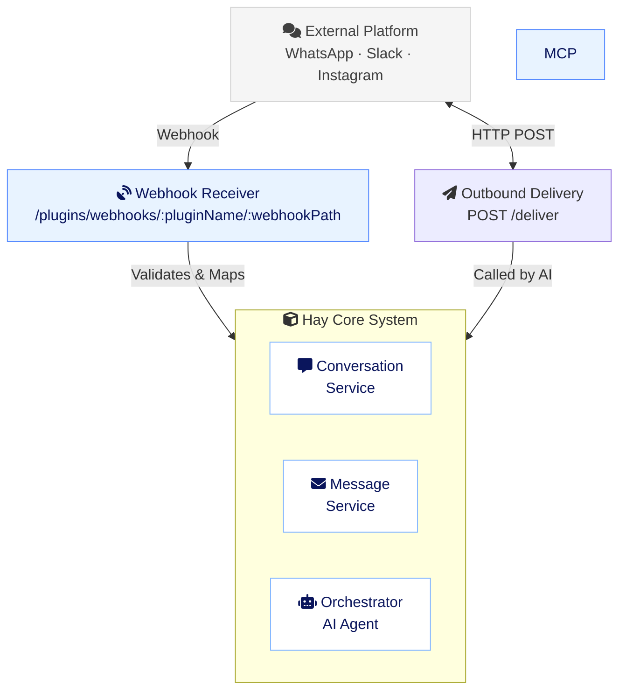

# Channel Plugin Architecture

> **Architecture design for chat channel plugins (WhatsApp, Slack, Instagram, Telegram, etc.)**

## Overview

Channel plugins enable bidirectional communication between Hay and external messaging platforms. They handle:
- **Inbound**: Receiving messages via webhooks and creating conversations
- **Outbound**: Sending messages through MCP tools called by the AI
- **Mapping**: Converting between platform-specific and Hay message formats
- **Routing**: Determining which agent handles each channel

---

## Architecture: Webhook Router + MCP Tools (Selected)

### Key Principles

1. **Webhooks for Inbound**: Fast, real-time message reception
2. **MCP Tools for Outbound**: AI-controlled message sending
3. **Platform Validation**: Each plugin implements its own webhook signature verification
4. **Conversation Reuse**: Check for active conversations before creating new ones
5. **Agent Mapping**: Organization-level configuration for channel → agent routing
6. **Existing Approval Rules**: Leverage agent/organization test mode for message approval

---

## System Architecture



---

## Component Design

### 1. Plugin Structure

```
plugins/core/whatsapp/
├── manifest.json                    # Plugin configuration
├── package.json                     # Dependencies
├── src/
│   ├── index.ts                    # Plugin entry point
│   ├── webhook.ts                  # Webhook receiver logic
│   ├── deliver.ts                  # Outbound message delivery (POST /deliver)
│   └── signature.ts                # Twilio HMAC signature verification
└── components/                      # UI components
    └── settings/
        └── WhatsAppSettings.vue    # Channel configuration UI
```

### 2. Webhook Flow (Inbound Messages)

```typescript
// Route: /plugins/webhooks/whatsapp/:webhookPath
// Organization ID passed via ?org=<id> query param or x-organization-id header
export async function webhookHandler(
  req: Request,
  res: Response,
  ctx: PluginContext
) {
  const organizationId = req.query.org as string || req.headers['x-organization-id'] as string;

  // 1. Get plugin instance for this organization
  const pluginInstance = await pluginInstanceRepository.findByPlugin(
    organizationId,
    'whatsapp'
  );

  if (!pluginInstance || !pluginInstance.enabled) {
    throw new Error('WhatsApp plugin not enabled');
  }

  // 2. Validate Twilio HMAC signature
  const isValid = await validateTwilioSignature(
    req.body,
    req.headers['x-twilio-signature'] as string,
    pluginInstance.config.authToken
  );

  if (!isValid) {
    throw new Error('Invalid webhook signature');
  }

  // 3. Parse webhook payload
  const messages = parseWhatsAppWebhook(req.body);

  // 4. Process each message
  for (const msg of messages) {
    await processInboundMessage({
      organizationId,
      pluginId: 'whatsapp',
      externalId: msg.from,
      content: msg.text,
      metadata: {
        whatsapp_message_id: msg.id,
        timestamp: msg.timestamp,
        type: msg.type
      }
    });
  }

  return { success: true };
}
```

### 3. Message Processing Logic

```typescript
async function processInboundMessage(data: {
  organizationId: string;
  pluginId: string;
  externalId: string;  // phone number, user ID, etc.
  content: string;
  metadata?: Record<string, unknown>;
}) {
  // 1. Find or create customer
  const customer = await customerService.findOrCreate({
    organizationId: data.organizationId,
    externalId: data.externalId,
    externalMetadata: {
      [data.pluginId]: {
        id: data.externalId,
        firstSeenAt: new Date()
      }
    }
  });

  // 2. Find active conversation for this customer and channel
  let conversation = await conversationRepository.findActiveByCustomerAndChannel(
    customer.id,
    data.pluginId  // 'whatsapp', 'slack', etc.
  );

  // 3. Create conversation if none exists or last one is closed
  if (!conversation || conversation.status === 'closed') {
    // Get agent for this channel
    const agentId = await getAgentForChannel(
      data.organizationId,
      data.pluginId
    );

    conversation = await conversationService.createConversation(
      data.organizationId,
      {
        channel: data.pluginId,
        customer_id: customer.id,
        agentId,
        status: 'open'
      }
    );

    // Add initial system message and bot greeting
    await conversation.addInitialSystemMessage();
    await conversation.addInitialAgentInstructions();
    await conversation.addInitialBotMessage();
  }

  // 4. Add customer message
  await conversation.addMessage({
    content: data.content,
    type: MessageType.CUSTOMER,
    metadata: data.metadata
  });

  // Message added → triggers cooldown → orchestrator processes
}
```

### 4. Agent Routing

Store channel → agent mapping in organization settings:

```typescript
// Organization entity
interface Organization {
  // ... existing fields
  settings: {
    // ... existing settings
    channelAgents?: Record<string, string>;
  };
}

// Helper function
async function getAgentForChannel(
  organizationId: string,
  channel: string
): Promise<string | null> {
  const org = await organizationRepository.findById(organizationId);

  // 1. Try channel-specific agent
  if (org?.settings?.channelAgents?.[channel]) {
    return org.settings.channelAgents[channel];
  }

  // 2. Fall back to default agent
  if (org?.defaultAgentId) {
    return org.defaultAgentId;
  }

  // 3. Fall back to first agent
  const agents = await agentRepository.findByOrganization(organizationId);
  return agents[0]?.id || null;
}
```

### 5. Outbound Delivery (POST /deliver)

Outbound messages are sent via an HTTP `POST /deliver` route exposed by the plugin, not via MCP tools. The AI calls this route to dispatch messages to the external platform.

```typescript
// src/deliver.ts
import twilio from 'twilio';

export async function deliverHandler(
  req: Request,
  res: Response,
  ctx: PluginContext
) {
  const { to, message, conversation_id } = req.body;
  const config = ctx.config;  // Plugin instance config

  // Call Twilio API
  const client = twilio(config.accountSid, config.authToken);
  const result = await client.messages.create({
    from: `whatsapp:${config.whatsappNumber}`,
    to: `whatsapp:${to}`,
    body: message
  });

  // Optional: Track message in Hay DB
  if (conversation_id) {
    await trackOutboundMessage({
      conversationId: conversation_id,
      externalMessageId: result.sid,
      status: 'sent'
    });
  }

  return res.json({
    success: true,
    message_id: result.sid,
    timestamp: new Date().toISOString()
  });
}
```

### 6. Webhook Signature Validation

Each platform has its own validation:

```typescript
// WhatsApp via Twilio (src/signature.ts)
import twilio from 'twilio';

async function validateTwilioSignature(
  body: any,
  signature: string,
  authToken: string
): Promise<boolean> {
  // Twilio uses its own HMAC-SHA1 validation via x-twilio-signature header
  return twilio.validateRequest(authToken, signature, body.url, body);
}

// Slack
async function validateSlackSignature(
  body: string,
  timestamp: string,
  signature: string,
  signingSecret: string
): Promise<boolean> {
  const crypto = require('crypto');
  const baseString = `v0:${timestamp}:${body}`;
  const expectedSignature = 'v0=' + crypto
    .createHmac('sha256', signingSecret)
    .update(baseString)
    .digest('hex');

  return crypto.timingSafeEqual(
    Buffer.from(signature),
    Buffer.from(expectedSignature)
  );
}

// Telegram (simpler - token in URL)
async function validateTelegramWebhook(
  token: string,
  expectedToken: string
): Promise<boolean> {
  return token === expectedToken;
}
```

---

## Database Schema Updates

### 1. Conversation Entity (Already Supports)

```typescript
@Entity("conversations")
export class Conversation {
  // Free-form string — not an enum, so new channels don't require migrations
  @Column({ type: "varchar", length: 64, default: "web" })
  channel!: string;

  // Customer relationship
  @Column({ type: "uuid", nullable: true })
  customer_id!: string | null;

  // ... rest of fields
}
```

### 2. Customer Entity (Enhancement)

```typescript
// Add external platform IDs to external_metadata
interface ExternalMetadata {
  whatsapp?: {
    id: string;           // Phone number
    name?: string;
    profilePicture?: string;
    firstSeenAt: Date;
  };
  instagram?: {
    id: string;           // Instagram user ID
    username?: string;
    firstSeenAt: Date;
  };
  slack?: {
    id: string;           // Slack user ID
    teamId: string;
    firstSeenAt: Date;
  };
  [key: string]: any;
}
```

### 3. Organization Entity (Enhancement)

```typescript
// Add to settings
interface OrganizationSettings {
  // ... existing settings
  channelAgents?: Record<string, string>;
}
```

### 4. Source Entity (Already Exists)

```typescript
@Entity("sources")
export class Source {
  @PrimaryColumn({ type: "varchar", length: 50 })
  id!: string;  // 'whatsapp', 'slack', etc.

  @Column({ type: "varchar", length: 100 })
  name!: string;

  @Column({ type: "enum", enum: SourceCategory })
  category!: SourceCategory;  // 'messaging', 'social', etc.

  @Column({ type: "varchar", length: 100, nullable: true })
  pluginId!: string | null;  // Link to plugin

  // ... rest
}
```

---

## Implementation Checklist

### Phase 1: Core Infrastructure
- [ ] Create webhook router service (`ChannelWebhookService`)
- [ ] Add webhook routes (`/plugins/webhooks/:pluginName/:webhookPath`, org via `?org=<id>` or `x-organization-id` header)
- [ ] Implement `getAgentForChannel()` helper
- [ ] Add `channelAgents` to Organization settings
- [ ] Update `findOrCreate` logic in CustomerService for external IDs

### Phase 2: WhatsApp Plugin
- [ ] Create plugin directory structure (`src/index.ts`, `src/webhook.ts`, `src/deliver.ts`, `src/signature.ts`)
- [ ] Implement webhook handler with Twilio HMAC signature validation (`x-twilio-signature`)
- [ ] Implement message parser/mapper
- [ ] Implement outbound delivery via `POST /deliver` using Twilio client
- [ ] Create settings UI component

### Phase 3: UI for Agent Mapping
- [ ] Add "Channels" section to Organization Settings
- [ ] Show channel → agent dropdown for each enabled channel plugin
- [ ] Display active channels and their configurations

### Phase 4: Testing & Documentation
- [ ] Test webhook validation (Twilio HMAC signature)
- [ ] Test conversation creation/reuse
- [ ] Test agent routing
- [ ] Test outbound delivery via `POST /deliver`
- [ ] Document webhook URLs for each platform

---

## UI Design: Channel Agent Mapping

### Location: Organization Settings > Channels

```vue
<template>
  <div class="channels-section">
    <h3>Channel Configuration</h3>
    <p class="text-muted">Configure which agent handles each channel</p>

    <div v-for="plugin in channelPlugins" :key="plugin.id" class="channel-row">
      <div class="channel-info">
        <Icon :name="plugin.icon" />
        <span>{{ plugin.name }}</span>
        <Badge v-if="plugin.enabled" variant="success">Active</Badge>
      </div>

      <Select
        v-model="channelAgents[plugin.id]"
        :options="agentOptions"
        placeholder="Use default agent"
        @change="updateChannelAgent(plugin.id)"
      />
    </div>
  </div>
</template>
```

---

## Example: WhatsApp Plugin manifest.json

```json
{
  "$schema": "../../base/plugin-manifest.schema.json",
  "id": "whatsapp",
  "name": "WhatsApp Business",
  "version": "1.0.0",
  "description": "Connect WhatsApp Business for two-way customer conversations",
  "author": "Hay",
  "type": ["channel", "mcp-connector"],
  "entry": "./dist/index.js",
  "enabled": true,
  "category": "chat",
  "icon": "whatsapp",

  "capabilities": {
    "chat_connector": {
      "webhooks": {
        "path": "/whatsapp",
        "events": ["message.received", "message.status", "message.read"]
      }
    }
  },

  "configSchema": {
    "accountSid": {
      "type": "string",
      "label": "Account SID",
      "description": "Twilio Account SID",
      "required": true,
      "encrypted": true,
      "env": "TWILIO_ACCOUNT_SID"
    },
    "authToken": {
      "type": "string",
      "label": "Auth Token",
      "description": "Twilio Auth Token (used for HMAC signature validation)",
      "required": true,
      "encrypted": true,
      "env": "TWILIO_AUTH_TOKEN"
    },
    "whatsappNumber": {
      "type": "string",
      "label": "WhatsApp Number",
      "description": "Twilio WhatsApp-enabled phone number (e.g. +14155238886)",
      "required": true,
      "encrypted": false,
      "env": "TWILIO_WHATSAPP_NUMBER"
    }
  },

  "permissions": {
    "env": [
      "TWILIO_ACCOUNT_SID",
      "TWILIO_AUTH_TOKEN",
      "TWILIO_WHATSAPP_NUMBER"
    ]
  },

  "settingsExtensions": [
    {
      "slot": "after-settings",
      "component": "components/settings/WhatsAppSettings.vue"
    }
  ]
}
```

---

## Platform-Specific Considerations

### WhatsApp Business API (via Twilio)
- **Webhook**: Twilio webhook with HMAC signature validation (`x-twilio-signature`)
- **Authentication**: Twilio `accountSid` + `authToken`
- **Rate Limits**: Tiered based on Twilio account and phone number
- **Message Types**: Text, media, templates (for notifications)
- **External ID**: Phone number (E.164 format)

### Slack
- **Webhook**: Events API with signing secret validation
- **Authentication**: OAuth with bot token
- **Rate Limits**: Tier-based (varies by method)
- **Message Types**: Text, blocks, ephemeral, threads
- **External ID**: Slack user ID + workspace ID

### Instagram Messaging
- **Webhook**: Facebook Graph API (same as WhatsApp)
- **Authentication**: OAuth via Facebook Login
- **Rate Limits**: Similar to WhatsApp
- **Message Types**: Text, media, story replies
- **External ID**: Instagram-scoped user ID (IGID)

### Telegram
- **Webhook**: Simple HTTPS POST (optional token in URL)
- **Authentication**: Bot token from BotFather
- **Rate Limits**: Message-based (30 msgs/sec)
- **Message Types**: Text, media, inline keyboards
- **External ID**: Telegram user ID

---

## Security Considerations

1. **Webhook Validation**: Always validate signatures/tokens
2. **Replay Protection**: Track processed webhook IDs (avoid duplicates)
3. **Rate Limiting**: Implement per-channel rate limits
4. **Credential Storage**: All tokens encrypted in `plugin_instances.config`
5. **HTTPS Only**: All webhooks must be HTTPS in production
6. **IP Whitelisting**: Optional IP restrictions for webhooks
7. **Audit Logging**: Log all webhook receipts and tool invocations

---

## Future Enhancements

1. **Channel Priority**: Order channels by preference for customer support
2. **Channel Handoff**: Transfer conversations between channels
3. **Unified Inbox**: View all channel messages in one interface
4. **Channel Analytics**: Track performance per channel
5. **Smart Routing**: Auto-assign agent based on channel load
6. **Rich Media**: Handle images, videos, files across channels
7. **Channel Templates**: Pre-built message templates per channel

---

## References

- Plugin System Overview (`PLUGIN_API.md`)
- Plugin Quick Reference (`PLUGIN_QUICK_REFERENCE.md`)
- Channel Registration (`PLUGIN_CHANNEL_REGISTRATION.md`)
- Conversation Entity (`server/database/entities/conversation.entity.ts`)
- Source System (`server/routes/v1/sources/index.ts`)
